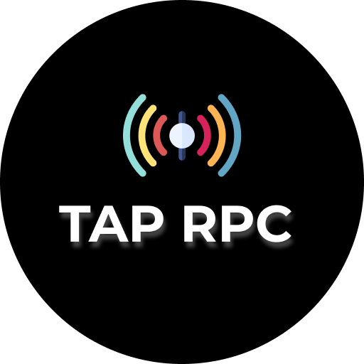

  

<h2 align="center">The REST Tool That You Missed </h2>
 

**Tap Rest** is a tool that helps in seamless development and testing of your REST api by allowing you to monitor and modify request and responses (path, body, query params etc.) in real time.

## Features

### **Monitor** mode :

- Monitor requests and responses by acting as the middle man between a client and server
- Modify request body, headers, path, query params, http method etc in real time before it reaches the backend server
- Modify response body, headers etc in real time before it reaches back the client